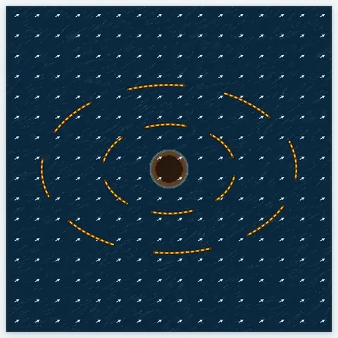
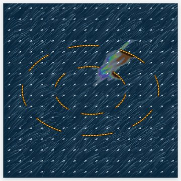
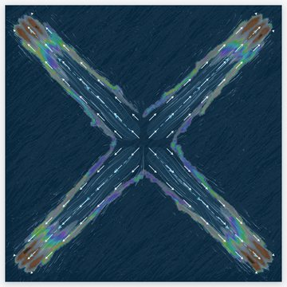
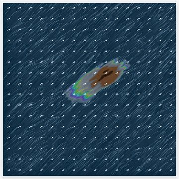
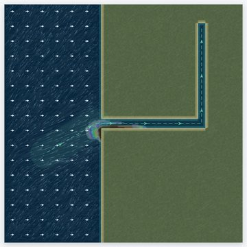
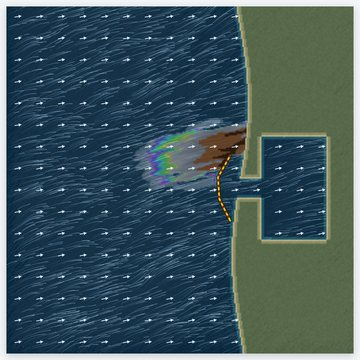
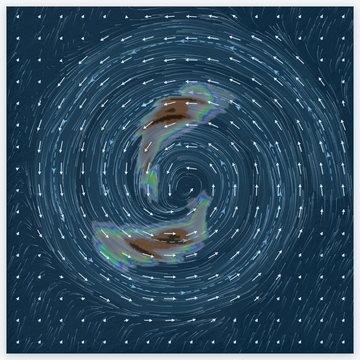
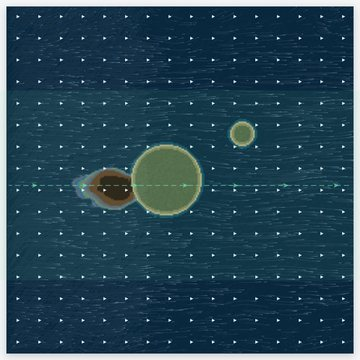
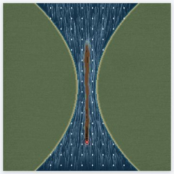
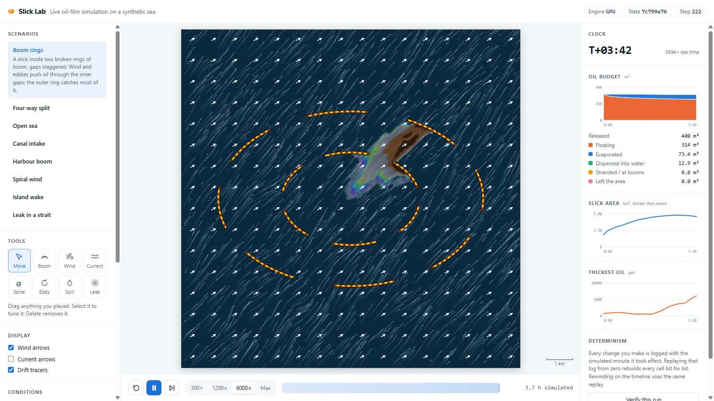

<div align="center">

# Slick Lab

**A physics-based oil spill simulator you can change while it runs, and whose every run can be replayed bit for bit.**

[**▶ Open the live simulator**](https://samratskevents.github.io/sih-oil-physics-model/) · Part of [**GUARDIANS**](https://github.com/SamratSKEvents/sih-guardians)

</div>

> [!NOTE]
> The sea here is synthetic: coasts, currents and coefficients are assumptions chosen to make the physics visible, not a forecast. In GUARDIANS the same engine runs on satellite-detected slicks with measured wind and current.

---

## Why it exists

When oil is spilled, responders have minutes to decide: where will it go, will the booms hold, which coast gets hit? Most spill models take hours to run and can't be touched while they run. Slick Lab answers those questions live: draw a boom, change the wind, add a current, and watch the oil respond at thousands of times real time.

## What you can do

- **Pick a situation.** Eight ready-made scenarios, from open sea to a leak in a tidal strait.
- **Change the sea while it runs.** Lay booms, draw wind or current paths that follow your stroke, drop a spiral wind or an eddy, spill oil or place a leak that keeps releasing. Everything can be dragged, tuned or deleted mid-run.
- **Tune the conditions.** Wind speed and direction, background and tidal current, eddies, windage, diffusion, film break-up.
- **Read the oil budget live.** Charts of oil floating, evaporated, dispersed, stranded and gone, plus slick area and the thickest oil, with hover readouts.
- **Rewind and branch.** Scrub back through the recording and resume from any moment: *what if the boom had gone in an hour earlier?*
- **Prove it.** *Verify this run* replays everything from zero in a second worker and checks a fingerprint of every cell, every step.

## A run, start to finish

<div align="center">



*Boom rings, about 11 simulated hours. The wind pushes the slick through a gap in the inner ring; the outer ring catches it and the film tears into patches.*

</div>

## Eight situations

| | | | |
|:---:|:---:|:---:|:---:|
|  |  |  |  |
| **Boom rings**<br><sub>Two broken rings of boom with staggered gaps</sub> | **Four-way split**<br><sub>Four winds tear a slick into four arms</sub> | **Open sea**<br><sub>Stretches downwind, streaks along windrows</sub> | **Canal intake**<br><sub>Drawn into the mouth and along the canal</sub> |
|  |  |  |  |
| **Harbour boom**<br><sub>A boom holds oil off a harbour mouth</sub> | **Spiral wind**<br><sub>A cyclonic wind winds two slicks into arms</sub> | **Island wake**<br><sub>A current drives the slick onto an island</sub> | **Leak in a strait**<br><sub>A seabed leak feeds a tidal neck</sub> |

Colours follow the **Bonn Agreement** oil appearance code, the international standard for aerial surveillance: sheen, rainbow, metallic, then brown and black true colour where the oil is thick.

## The full interface



---

## The physics

The model is an oil layer with its own thickness and momentum, riding on a water layer, on a 12.8 km sea of 256 × 256 cells of 50 m. It combines the useful parts of four models into one:

| Process | How it is modelled |
|---|---|
| **Water movement** | Linear shallow water driven by tide (M2), wind, Earth's rotation (Coriolis) and bottom friction, with reflective coasts |
| **Oil spreading and drift** | Reduced-gravity shallow water for the oil layer (finite volume, MUSCL, SSP-RK2), dragged towards the surface drift of current + windage × wind |
| **Film break-up** | Below a terminal thickness the film stops spreading and gathers into patches: negative diffusion with hyperdiffusion setting the tear wavelength |
| **Turbulence** | Sub-grid turbulent diffusion, along-wind shear dispersion, Langmuir windrows and eddies |
| **Thick head, thin tail** | Thin oil drifts slower than thick oil along the wind, so the slick forms a downwind head and a sheen tail |
| **Evaporation** | Fingas evaporation curve |
| **Natural dispersion** | Breaking-wave entrainment rate per wind speed, taken from a volume-of-fluid wave-section model |
| **Stranding** | Oil moving onshore strands until the shoreline's capacity is full; booms stop and collect it |

The oil budget always closes: released = floating + evaporated + dispersed + stranded + left the area.

## Built for speed

- **WebGPU engine.** The whole model step runs as GPU compute shaders in the browser, with no install. It's **7–12× faster** per simulated minute than the CPU engine, so hours of drift play out in seconds (speeds up to 6000× and *Max*).
- **CPU fallback.** A 64-bit CPU engine runs where WebGPU is missing, or when picked in the header.
- **Validated against each other.** After 4 simulated hours across the scenarios, floating volume and evaporation agree within 0.1 %, sheen area within 5 %.

## Reproducible by design

The simulation advances in fixed one-minute steps, and every edit is logged against the step it landed on. A scenario plus its edit log *is* the run. That makes every result:

- **Auditable.** *Verify this run* replays the log from zero and compares every cell, step by step.
- **Comparable.** Rewind to any moment and branch a *what if*, knowing only your change differs.

---

## Technical notes

### Code map

| Path | What it is |
|---|---|
| `src/engine/` | The slick model, copied unchanged from the oil engine (only the files the model imports) |
| `src/gpu/` | The same step as WebGPU compute kernels (`kernels.ts`, a line-for-line port of the CPU code it names), driven by `sim.ts` |
| `src/runner.ts` | Puts the model on a scenario's coast and applies edits |
| `src/world.ts` | The eight scenarios: coasts, booms, sources, wind and current paths |
| `src/worker.ts` | Runs the simulation off the main thread |
| `src/main.ts`, `src/render.ts`, `src/charts.ts` | The page, the sea renderer and the live charts |
| `tools/validate.html` | Runs every scenario on both engines and compares them |

### GPU engine details

The GPU engine runs in 32-bit floats; the CPU engine is 64-bit. Each simulated minute is one submission, and minute *c* sizes its substeps from the fastest oil speed read back at the end of minute *c* − 2, so two minutes are in flight and readback latency is hidden. That rule depends only on step numbers, and nothing uses atomics or order-dependent sums, so a GPU run replays bit-identically on the same GPU and browser. A run recorded on one GPU is not expected to replay bit for bit on another.

Where the port cannot be literal it says so in the kernel: stranding is resolved in three passes (ask, grant, give) instead of the CPU's cell-by-cell walk, and windrow lines use an integer hash in place of the CPU's `sin` hash.

On a Radeon RDNA2 laptop GPU, after 4 simulated hours: 7–12× faster per simulated minute (5–8 ms against 40–90 ms), floating volume and evaporation within 0.1 %, sheen area within 5 %, footprints overlapping 0.78–0.98. The narrow canal differs most (floating +6 %, stranded −17 %): in a 9-cell-wide channel, small differences in where the oil meets the wall grow.

---

## Running it locally

Requires Node.js and a browser with WebGPU (Chrome or Edge) for the GPU engine; others use the CPU engine.

```bash
npm install
npm run dev     # http://localhost:5288
```

On Windows, double-click `run.bat`.

| Command | What it does |
|---|---|
| `npm test` | Determinism, and that the CPU engine's output is unchanged bit for bit |
| `npm run build` | Type-check and build the static site into `dist/` |
